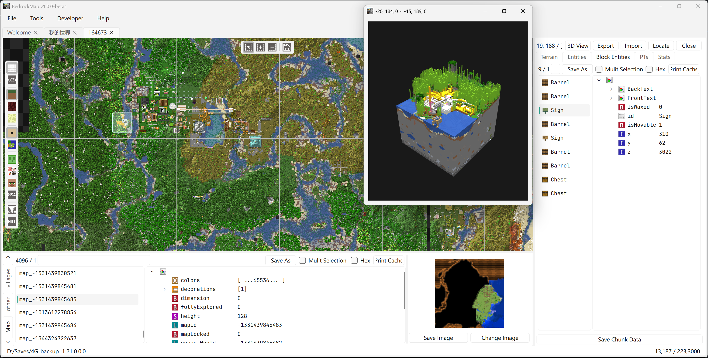

<p align="center">
  
</p>

# BedrockMap

[English](./README.md) | **简体中文**

**BedrockMap** 是一款基于 Qt6 和 C++17 构建的、完全开源的《我的世界》基岩版地图编辑器。它提供了一套全面的工具，用于浏览、检查和编辑基岩版世界存档（LevelDB 格式），支持所有维度。

## 功能特性

- **世界浏览** — 打开并探索主世界、下界和末地，以及自定义维度的基岩版世界
- **地形可视化** — 生物群系地图和地形叠加层，支持可配置的渲染过滤
- **区块编辑器** — 选择、检查和删除区块；可视化区块实体、方块实体和计划刻（pending ticks）
- **区块复制粘贴** — 复制选中区域并粘贴到其他世界，甚至跨存档，支持交互式放置
- **NBT 编辑器** — 查看和修改 NBT 数据，包括 `level.dat`、玩家物品栏、村庄、地图物品等
- **mcstructure 支持** — 浏览和编辑 `.mcstructure` 文件（带 3D 体素预览），并可将选中区域或区块导出为 `.mcstructure` 文件
- **体素渲染** — 选中区域的 3D 体素可视化，可导出为 GLB 模型
- **多标签工作区** — 同时打开和管理多个世界

### 构建

```powershell
# 使用子模块克隆
git clone --recursive https://github.com/bedrock-dev/BedrockMap.git

# 构建 BedrockMap
.\scripts\build.ps1 -buildBL
```

## 许可证

BedrockMap 基于 [GNU Affero General Public License v3.0](./LICENSE) 许可证发布。
