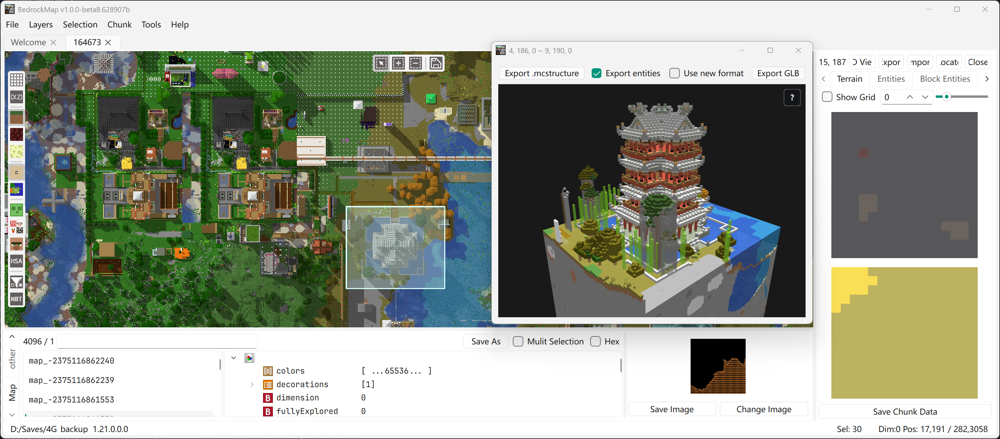

<p align="center">
  
</p>

# BedrockMap

<p align="center">
  
  
</p>

[English](./README.md) | **简体中文**

**BedrockMap** 是一款基于 Qt6 和 C++17 构建的、完全开源的《我的世界》基岩版地图编辑器。它提供了一套全面的工具，用于浏览、检查和编辑基岩版世界存档（LevelDB 格式），支持所有维度。

## 功能特性

- **世界浏览** — 打开并探索主世界、下界和末地，以及自定义维度的基岩版世界
- **地形可视化** — 生物群系地图和地形叠加层，支持可配置的渲染过滤
- **区块编辑器** — 选择、检查和删除区块；可视化区块实体、方块实体和计划刻（pending ticks）
- **区块复制粘贴** — 复制选中区域并粘贴到其他世界，甚至跨存档，支持交互式放置
- **NBT 编辑器** — 查看和修改 NBT 数据，包括 `level.dat`、玩家物品栏、村庄、地图物品等
- **mcstructure 支持** — 浏览和编辑 `.mcstructure` 文件（带 3D 体素预览），并可将选中区域或区块导出为 `.mcstructure` 文件
- **体素渲染** — 选中区域的 3D 体素可视化，可导出为 GLB 模型
- **多标签工作区** — 同时打开和管理多个世界

## 下载

从 [Release 页面](https://github.com/bedrock-dev/BedrockMap/releases) 下载最新版本。

## 系统要求

- **操作系统** — Windows 10

## 快速上手

通过 **文件 → 打开世界**（`Ctrl+O`）打开世界，或直接将世界文件夹、`.mcstructure`、`.nbt` 文件拖入窗口。

地图视图中：**左键拖动**平移，**右键**打开菜单，**滚轮按下拖动**框选区域，**滚动滚轮**缩放。

常用快捷键：

| 快捷键                    | 功能                                                   |
| ------------------------- | ------------------------------------------------------ |
| `Ctrl+O` / `Ctrl+Shift+O` | 打开世界 / 打开文件（`.mcstructure`、`.nbt`、`.nbts`） |
| `Ctrl+C` / `Ctrl+V`       | 复制 / 粘贴选中区域（支持跨存档）                      |
| `Ctrl+E` / `Ctrl+I`       | 导出 / 导入选区                                        |
| `Ctrl+D`                  | 删除选中的区块                                         |
| `Ctrl+H`                  | 打开 3D 体素视图                                       |
| `Alt+1`–`Alt+4`           | 切换维度（主世界 / 下界 / 末地 / 自定义）              |
| `Ctrl+G`                  | 跳转到坐标                                             |

## 构建

```powershell
# 使用子模块克隆
git clone --recursive https://github.com/bedrock-dev/BedrockMap.git

# 构建 BedrockMap
.\scripts\build.ps1 -buildBL
```

## 支持的 MCBE 版本

支持 Minecraft 基岩版 1.2（可能更早）及以后的世界，直到 1.21 系列（不同版本的区块格式可能不同）。

## 参与贡献

欢迎通过 [Issues](https://github.com/bedrock-dev/BedrockMap/issues) 提交 Bug 报告和功能建议。规划中的功能和已知问题见 [TODO.md](./TODO.md)。

## 许可证

BedrockMap 基于 [GNU Affero General Public License v3.0](./LICENSE) 许可证发布。

## Credits

- [bedrock level](https://github.com/bedrock-dev/bedrock-level) 用于软件后端
- [Minecraft Wiki](https://minecraft.wiki/) 提供生物、NBT以及方块实体等图标
