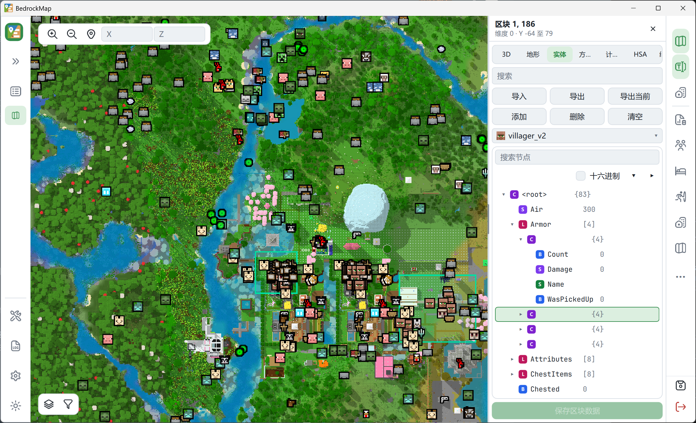
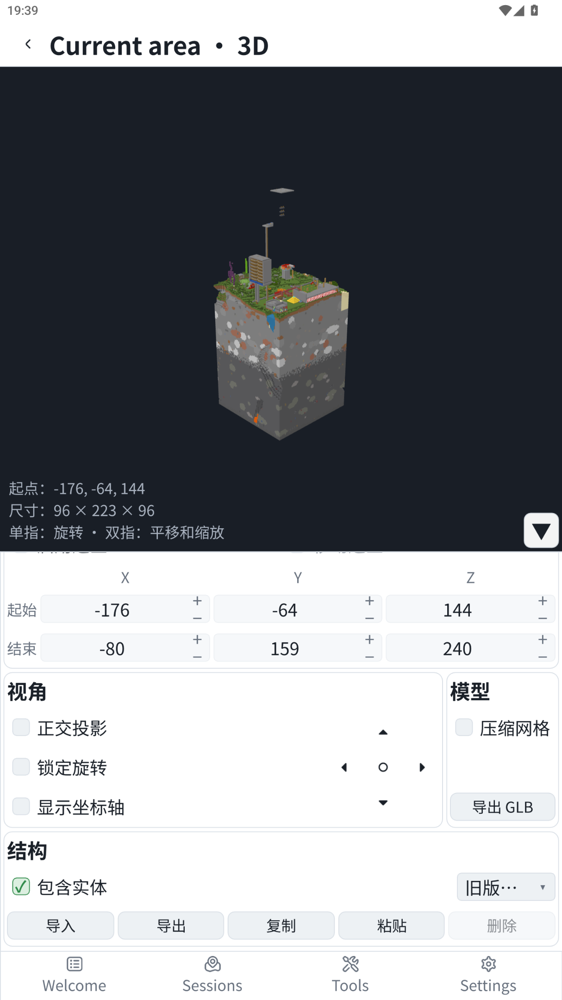

<p align="center">
  &emsp;
</p>

# BedrockMap

<p align="center">
  
  
</p>

[English](./README.md) | **简体中文**

**BedrockMap** 是一款覆盖桌面、移动端与浏览器的开源**高性能、跨平台《我的世界》基岩版地图编辑器**，基于 **C++20**、Qt 6 和 Qt Quick 构建，可跨维度浏览、检查和编辑基岩版世界存档（LevelDB 格式）。

支持 **Minecraft 基岩版 1.2 起的所有版本**。

> **[在线体验网页 Demo](https://bedrock-dev.github.io/bm/web/)** — 无需安装。首次需要下载较大的文件，加载速度较慢，请耐心等待。

## 功能特性

- **世界浏览** — 打开并探索主世界、下界和末地，以及自定义维度的基岩版世界
- **地形可视化** — 生物群系地图和地形叠加层，支持可配置的渲染过滤
- **区块编辑器** — 选择、检查和删除区块；可视化区块实体、方块实体和计划刻（pending ticks）
- **区块复制粘贴** — 复制选中区域并粘贴到其他世界，甚至跨存档，支持交互式放置
- **NBT 编辑器** — 查看和修改 NBT 数据，包括 `level.dat`、玩家物品栏、村庄、地图物品等
- **mcstructure 支持** — 浏览和编辑 `.mcstructure` 文件（带 3D 体素预览），并可将选中区域或区块导出为 `.mcstructure` 文件
- **体素渲染** — 选中区域的 3D 体素可视化，可导出为 GLB 模型
- **多会话工作区** — 同时打开和管理多个世界

## 下载

从 [Release 页面](https://github.com/bedrock-dev/BedrockMap/releases) 下载最新版本。

## 支持平台

| 平台 | 支持情况 |
| --- | --- |
| 桌面端 | Windows 10 及更新版本 |
| 移动端 | Android 9 及更新版本（arm64-v8a） |
| 浏览器 | 在 Chrome、Edge 或其他支持 File System Access API 的 Chromium 浏览器中运行实验性 WebAssembly 演示 |

## 快速上手

在世界列表中打开存档，也可以将世界文件夹或 `.mcstructure` 文件拖入应用。地图支持平移、缩放、选择和右键菜单。

## 构建

构建需要 Qt 6 和支持 C++20 的编译器。以下命令用于构建和运行 Windows 桌面端。

```powershell
# 使用子模块克隆
git clone --recursive https://github.com/bedrock-dev/BedrockMap.git

# 构建 Qt Quick 应用
.\scripts\build.ps1

# 运行
.\scripts\run.ps1
```

## 参与贡献

欢迎通过 [Issues](https://github.com/bedrock-dev/BedrockMap/issues) 提交 Bug 报告和功能建议。

## 许可证

BedrockMap 基于 [GNU Affero General Public License v3.0](./LICENSE) 许可证发布。

## Credits

- [bedrock level](https://github.com/bedrock-dev/bedrock-level) 用于软件后端
- [Minecraft Wiki](https://minecraft.wiki/) 提供生物、NBT以及方块实体等图标
